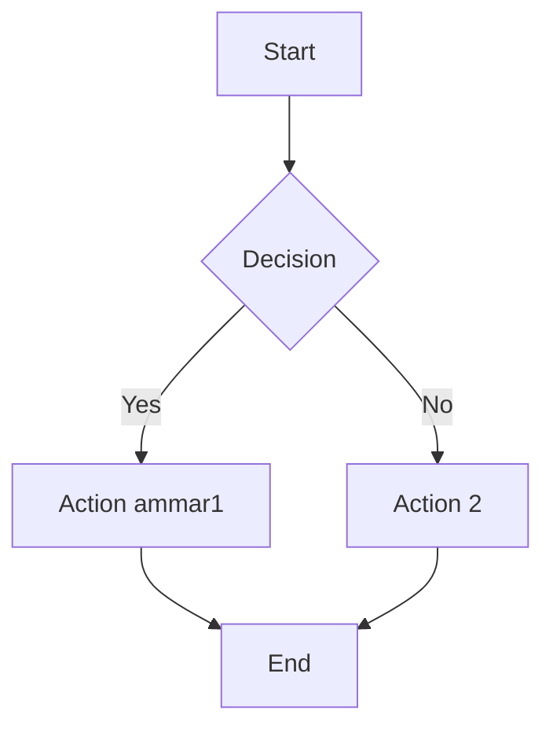
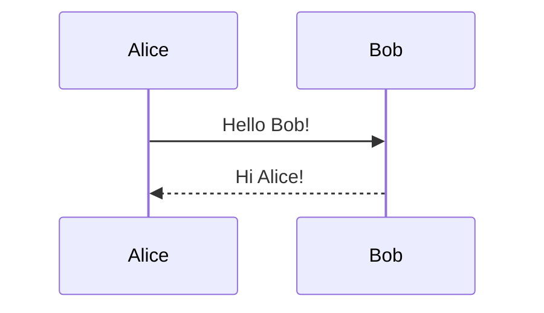

# Mermaid Test

## Flowchart


## Sequence Diagram


## Class Diagram
```mermaid
classDiagram
    class Animal {
        +String name
        +int age
        +makeSound()
    }
    class Dog {
        +bark()
    }
    Animal <|-- Dog